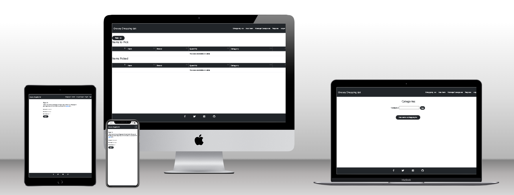
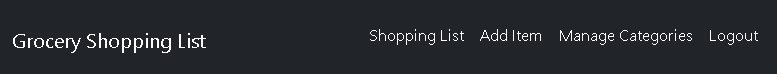
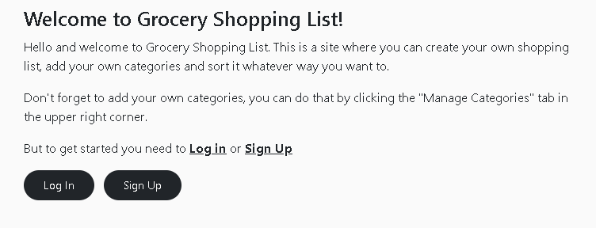
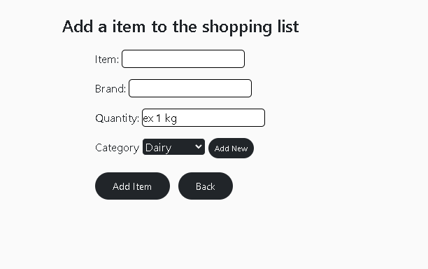
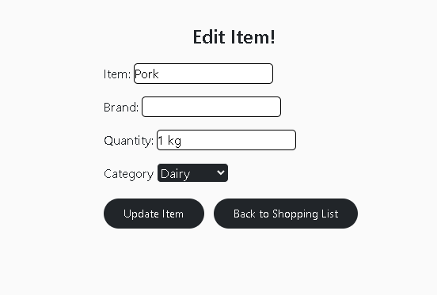
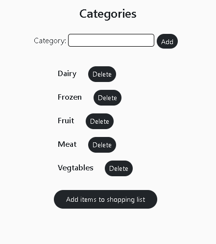
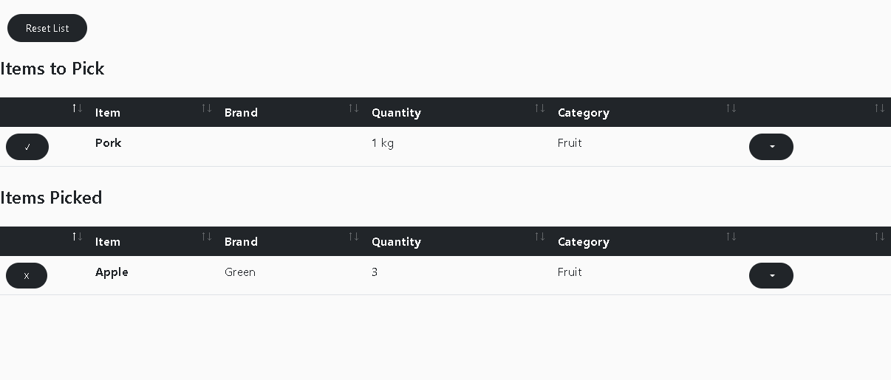
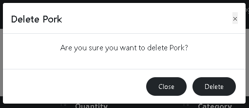

# **Grocery Shopping List**

[Grocery Shopping List Live Site](https://stealthy-grocery-shopping-list.herokuapp.com/)



## **Introduction**

Welcome to Grocery Shopping List.

My fourth and next-to-last project for the Full Stack Web Developer Course at Code Institute is called Grocery Shopping List.

This website's goal is to help users create a useful shopping list that they may customize to fit their shopping preferences.
HTML, CSS, JavaScript, Python, and Django are the technologies used for this project. ElephantSQL serves as a relational database, and Allauth manages user registration and login.
---

## **UXD - User Experience Design**

This project was planned in large part as a result of my own frustration with shopping apps.

I decided to design an intuitive software keeping that in consideration as well as the results of various interviews.

The project's planning is divided into 5 planes,

- The Strategy Plane
- The Scope Plane
- The Structure Plane
- The Skeleton Plane
- The Surface Plane
---

## **The Strategy Plane**

### **Creator Goals**
- As a creator, I want the site to be easy to navigate.
- As a creator, I want to allow users to sort the list after their needs.

#### **User Stories**
- As a user, I want to be able to sign up, so that I can have my personal shopping list and categories.
- As a user, I want to be able to see confirmations when tasks are done, so that I can confirm that they were successful.
- As a user, I want to be able to add multiple items, so that i don't need to return to the list page everytime and save time.
- As a user, I want to be able to add a brand to my item, so that i specify what item i want.
- As a user, I want to be able to add a quantity to my item, so that know how much i need.
- As a user, I want to be able to edit items, so that i can change it without deleting.
- As a user, I want to be able to add my own categories, so that i personalize it after my needs.
- As a user, I want to be able to manage my categories, so that i add more and delete the ones i don't want anymore.
- As a user, I want to be able to toggle the items as i pick them up, so that i can see what items are left to pick.
- As a user, I want to be able to sort my list the way i want, so that i can specialize it after my needs.
- As a user, I want to be able to delete the list, so that i can start from scratch the next time.

My user stories where obtained from my own personal experiences and interviews. 

---

## **The Scope Plane**

To be sure that my project was launched with a ready-to-use site I opted to divide the project into three phases.

**Phase 1**
- A project that would be good enough to use.
    - Home Page with an introduction.
    - Navbar allowing the user to navigate to different pages.
    - Shopping list view to see the items. 
    - Page to add and edit items.
    - The ability to delete items and list.
    - Sign up and login function

**Phase 2**
- Building upon the Phase 1 project with additional features.
    - User-specific categories
    - Modals to ensure the user is sure to delete items
    - Keep picked items under a new header to separate the items

**Phase 3**
- My final planned phase was to implement functionality that made it easier for the user(these are not yet implemented).
    - Sign up with social media accounts
    - Password recovery
    - The choice to share the list with others
---

## **The Structure Plane**

#### **Colors**

I only used two distinct colors for this project. I did this because I wanted the site to feel simple and the functionality to be the main focus.

#212529
- I decided to use this color for every element on the page, including the navbar, footer, buttons, and table heads. The dark grey, slightly blue-tinged tint is appealing to me.
The bootstrap dark color and table head are used to create the color.

#FAFAFA
- Both the text and the background were in an off-white hue. The off-white color is a wonderful backdrop contrast to my other color without being very bright.

#### **Fonts**

- I choose to use the standard font for my project. This is so because it complemented the straightforward, simple approach I took to this project.

#### **Key Models**

**ShoppingItem**
- The Shopping item model is the main model to add items to the shopping list.
- It hold all the important information about the item. 
- The item is connected to the imported user model.

**Category**
- The category model holds the information about the category
- The category is connected to the imported user model, to make sure that the user has their own categories.
---

## **The Skeleton Plane**

This was my initial plan, however I made some adjustments as the project got farther along.
I tried to make the computer and mobile versions as similar as I could.

So, this is my initial project layout in its most basic form.


---

## **The Surface Plane**

### **Features**

*Features present across the project,*

**Navigation Bar**
- Navbar is implemented on every page and is fully responsive across all resolutions.
- Users can navigate across the site freely as long as they are signed in.



**Introduction**
- The home page features an introduction to notify users to welcome them and explain the purpose of the site.



**Add item page**
- Add item page, where the user inserts all the information about the item they want to add to the list.



**Edit item page**
- Users can edit already added items to the list.



**Category**
- Users can add and manage their categories on this page



**Shopping List**
- The user can view their added items in this list view.
- The user can easy see what items they have picked and what is left to pick.
- All the table heads are sortable.
- A button to reset the list when the user is done.



**Delete Modal**
- A modal to ensure that the user are sure to delete the item or list.



**Footer**
- Footer with social media links that open in new tabs.


---

## **Technologies Used**

- [Python](https://www.python.org/) 
    - The following Python modules were used on this project, 
    - asgiref==3.5.2
    - cloudinary==1.30.0
    - dj-database-url==1.0.0
    - dj3-cloudinary-storage==0.0.6
    - Django==3.2.16
    - django-allauth==0.51.0
    - django-filter==22.1
    - gunicorn==20.1.0
    - oauthlib==3.2.2
    - psycopg2==2.9.5
    - PyJWT==2.6.0
    - python3-openid==3.2.0
    - pytz==2022.6
    - requests-oauthlib==1.3.1
    - sqlparse==0.4.3

- [ElephatnSQL](https://www.elephantsql.com/)

- [Allauth](https://django-allauth.readthedocs.io/en/latest/)
 
- [HTML](https://developer.mozilla.org/en-US/docs/Web/HTML)

- [CSS](https://developer.mozilla.org/en-US/docs/Learn/Getting_started_with_the_web/CSS_basics)

- [Bootstrap](https://getbootstrap.com/)

- [jQuery](https://jquery.com/)

- [Google Developer Tools](https://developers.google.com/web/tools/chrome-devtools)

- [Github](https://github.com/)

- [Gitpod](https://www.gitpod.io/)

- [Balsamiq](https://balsamiq.com/)

- [Quillbot](https://quillbot.com/)

- [Grammarly](https://www.grammarly.com/)

- [Font Awesome](https://fontawesome.com/)

---

## **Testing**

Link to the Testing Document
- [TESTING.md](docs/TESTING.md)
---

## **Deployment**

The master branch of this repository is the most current version and has been used for the deployed version of the site.

The Code Institiue student template was used to create this project.

[Code Institute Full Template](https://github.com/Code-Institute-Org/gitpod-full-template)

- Click the *Use This Template* button.
- Give your repository a name, and description if you wish.
- Click the *Create Repository from Template* to create your repository. 
- Click the *Gitpod* button to create a gitpod workspace, this can take a few minutes.
- When working on project using Gitpod, please open the workspace from Gitpod, this will open your previous workspace rather than creating a new one.
Use the following commands to commit your work, 
- `git add . ` - adds all modified files to a staging area.
- `git commit -m "A short message exlaining your commit"` - commits all changes to a local repository.
- `git push` - pushes all your commited changes to your Github repository.


**Creating a Clone**

1. From the repository, click *Code*
2. In the *Clone >> HTTPS* section, copy the clone URL for the repository
3. In your local IDE open Git Bash
4. Change the current working directory to the location where you want the cloned directory to be made
5. Type `git clone`, and then paste the URL you copied in Step 2 - ``git clone https://github.com/Harry-Leepz/Nourish-and-Lift.git``
6. Set the following values in a `env.py` file.
```
import os

os.environ.setdefault("SECRET_KEY", "<app secret key of your choice>")
os.environ.setdefault("DEVELOPMENT", "True")
os.environ["CLOUDINARY_URL"] = "cloudinary key"
```

7. Install the project requirements - `pip3 install requirements.txt`
8. Apply database migrations - `python manage.py migrate`
9. Create a superuser - `python manage.py createsuperuser`
10. The project can be run with the following - `python manage.py runserver`

**Heroku Deployment**

1. Log into Heroku
2. Create a new app, choose a location closest to you
3. Make sure to have `dj_database_url` and `psycopg2` installed.
```
pip3 install dj_database_url
pip3 install psycopg2
```
5. Login to the Heroku CLI - `heroku login -i`
6. Run migrations on Heroku Postgres - `heroku run python manage.py migrate`
7. Create a superuser - `python manage.py createsuperuser`
8. Install `gunicorn` - `pip3 install gunicorn`
9. Create a requirements.txt file - `pip3 freeze > requirements.txt`
10. Create a `Procfile` (note the capital P), and add the following,
```
web: gunicorn moose_juice.wsgi:application
```
11. Disable Heroku from collecting static files - `heroku config:set DISABLE_COLLECTSTATIC=1 --app <your-app-name>`
12. Add the hostname to project settings.py file
```
ALLOWED_HOSTS = ['<you-app-name>.herokuapp.com', 'localhost']

```
13. Connect Heroku to you Github, by selecting Github as the deployment method and search for the github repository and pressing `connect`
14. In Heroku, within settings, under config vars select `Reveal config vars`
15. Add the following, 
```
DATABASE_URL =	<your database key here>
DISABLE_COLLECTSTATIC =	1 
SECRET_KEY = <your variable here>
```
16. Go back to the Deploy tab and under Automatic deploys choose `Enable Automatic Deploys`
17. Back in your CLI add, commit and push your changes and Heroku will automatically deploy your app
```
git add .
git commit -m "Initial commit"
git push
```
18. Your deployed site can be launched by clicking `Open App` from its page within Heroku.

---

## **Credits**

**Code**

- A large amount of code came from the Code Institute, "Hello Django" and "I Think Therefore I Blog".
    - Both these are walkthrough projects by Code Institute, which gave students an introduction to Django and how to use custom Models and CRUD functionality

- The bounce effect used on submit buttons is taken from
    - [BBBootstrap Team](https://freefrontend.com/bootstrap-buttons/)
        

