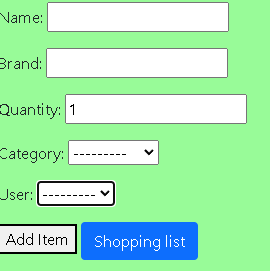
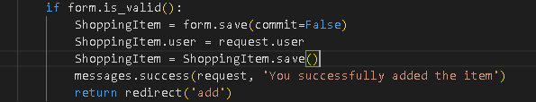
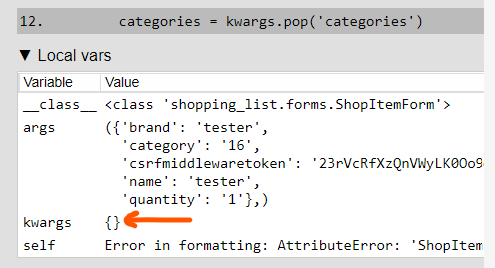
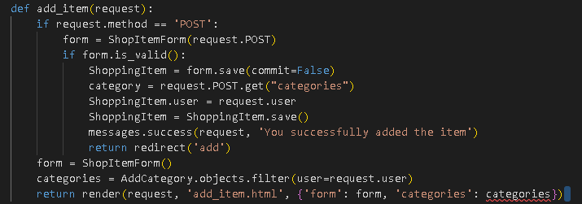
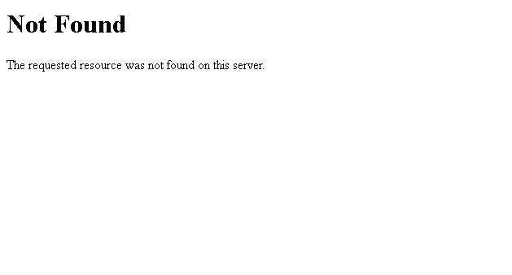
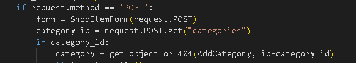
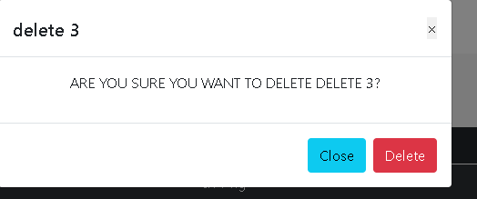
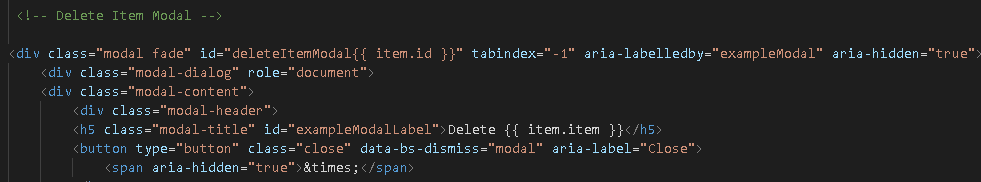

[Back to README](/README.md)

### **User Stories Testing**

- [User Stories Testing](https://github.com/Stealthy20/grocery-shopping-list/blob/main/docs/userstorytesting.pdf)

### **Manual Testing**

**Navigation Bar** 
- Navigation bar is fully responsive on large/medium/small resolutions.
- At 320px, all navigation links are inline and not wrapping on another line.
- All links are correctly redirecting to the correct pages. 
- Signing out, correctly shows the correct dropdown options, Log in and Register.
- Signing in, correctly shows the correct dropdown options, My profile, and Logout.

**Footer**
- Links redirect to the correct social media page.
- Links open in a new browser tab. 

**Add Item**
- User stays on the page when item are added.
- Can't progress without adding mandatory fields.
- Feedback when mandatory fields are missing. 
- Message are displayed when item are successfully added.
- All buttons correctly redirects.

**Edit item**
- Correctly gets the info from the item that's up for edit.
- Item get correctly updated. 
- All buttons correctly redirects.

**Category**
- User can add new categories.
- Users can only see their own categories and not other users.
- Message are displayed when a category are successfully added.
- Modal displaying the correct item when deleting.
- Item gets deleted when accepting the modal.
- All buttons correctly redirects.

**Shopping List**
- Users can see their own added items correctly.
- Toggle function correctly moves the items under the correct heading when pressed.
- Reset list button successfully deletes all the users items and not all items in database.
- All the sorting options works as intended.
- All buttons correctly redirects.

**Delete Modal**
- All delete modals works correctly.
- Modals can be closed by pressing outside of the modal itself.
- All buttons correctly redirects.

**Footer**
- All links are correctly redirecting to the correct pages and opens in new tabs

**Chrome Dev Tools**

Chrome dev tools was used throughout the development of the project to test responsiveness.
Responsiveness was tested using Dev Tools to emulate the following devices,
- Iphone 5
- Iphone 6/7/8
- Iphone 6/7/8 Plus
- Iphone X
- Ipad
- Ipad Pro

**Browser Testing**

During development, the testing was mainly done solely using Google Chrome.

In production the site has been tested on the following browsers,
- Google Chrome
- Mozilla Firefox
- Opera
- Microsoft Edge

---

### **Validation**

[W3C HTML Validator](https://validator.w3.org/)

[W3C CSS Validator](https://jigsaw.w3.org/css-validator/)
- No Errors

[JSHint JavaScript Validator](https://jshint.com/)
- No Errors

### **Bugs and Fixes**

**Bug1**
- The user wasn't automatic assigned to the item, which made all user be able to add items to eachothers lists.

**Fix**
- Added the ability for the form to save the item to the user when form is saved. 

**Bug 2**
- The first bug led me to the second one. When i tried to add the item it threw an error. 

**Fix**
- So i removed the category from the form and insted called it and set the choice from the frontend form with this code bellow. 

**Bug 3**
- When the user wanted to add a item to the list and didnt choose an category which is a required field. The user got an 404 error. 

**Fix**
- I added code to the view to check if category is truthy, if not throw an error message else procced. 

**Bug 4**
- My delete modals didn't pull the right item id to delete the item that was clicked. 

**Fix**
- Added {{item.id}} to the modal ID.

